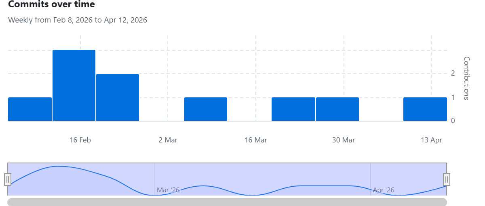

# Compilateur Mini-Pascal en Java

## Présentation

Ce projet a été réalisé en binôme dans le cadre du module de compilation.

L'objectif était de développer en Java un compilateur/interpréteur pour un langage de type Mini-Pascal, en mettant en oeuvre les principales étapes vues en cours : analyse lexicale, analyse syntaxique, vérifications sémantiques, génération d'un code intermédiaire, puis exécution du programme obtenu.

Au fil du projet, nous avons avancé progressivement en ajoutant les fonctionnalités une par une, puis en les testant sur différents exemples de programmes. Le dépôt GitHub a été utilisé dès le début pour partager le travail et suivre l'évolution du projet.

## Ce que nous avons réalisé

Le projet final comprend notamment :

- un analyseur lexical capable de reconnaître les identificateurs, les entiers, les chaînes, les mots réservés et les symboles du langage ;
- la gestion des séparateurs, des commentaires et des principales erreurs lexicales ;
- un analyseur syntaxique permettant de vérifier la structure générale d'un programme Mini-Pascal ;
- la gestion des déclarations de constantes et de variables ;
- des vérifications sémantiques simples sur les identificateurs, par exemple pour éviter les doubles déclarations ou l'utilisation d'identificateurs non déclarés ;
- la génération d'un P-Code ;
- l'écriture du P-Code généré dans un fichier ;
- un interpréteur permettant d'exécuter ce P-Code ;
- la prise en charge des instructions principales du langage : affectation, lecture, écriture, blocs, conditions `SI / ALORS / SINON` et boucles `TANTQUE / FAIRE` ;
- l'ajout des fonctions avec paramètres, y compris des appels récursifs.

## Notre compréhension du projet

Ce projet nous a permis de mettre en pratique de manière concrète le fonctionnement d'un compilateur.

Nous avons compris que chaque étape dépend fortement de la précédente : l'analyse lexicale transforme le texte source en unités lexicales, l'analyse syntaxique vérifie que ces unités suivent bien la grammaire attendue, les contrôles sémantiques permettent de valider le sens de certaines constructions, puis la génération de code produit une représentation exécutable par l'interpréteur.

Le travail sur le P-Code nous a aussi permis de mieux comprendre le lien entre un programme source et son exécution réelle, notamment pour les affectations, les tests conditionnels, les boucles et les appels de fonctions.

## Difficultés rencontrées

Les principales difficultés rencontrées pendant le projet ont été les suivantes :

- la gestion correcte des sauts dans le P-Code pour les conditions et les boucles ;
- l'ajout des fonctions avec paramètres, en particulier pour bien gérer les appels, les retours et la récursivité ;
- les phases de test et de correction, car chaque nouvelle fonctionnalité devait rester compatible avec les parties déjà réalisées.

## Démarche de travail

Le projet a été mené en binôme avec un avancement progressif. Nous avons travaillé étape par étape, en validant les différentes parties du compilateur avant de passer à la suite.

Nous avons utilisé GitHub dès le début du projet afin de centraliser le code, partager l'avancement et garder une trace régulière du travail effectué. Chaque étape importante validée a donné lieu à un commit, ce qui permet de montrer que le projet a été construit au fur et à mesure et non produit d'un seul bloc.

## Utilisation de l'intelligence artificielle

Nous souhaitons être transparents sur notre méthode de travail. Nous avons utilisé ponctuellement des outils d'intelligence artificielle comme aide technique, principalement pour débloquer certaines difficultés, vérifier des pistes de correction ou mieux comprendre certaines erreurs.

Cette utilisation est restée un support de travail et non une génération complète du projet. Le code a été développé, testé, corrigé et intégré par nous-mêmes, directement dans notre dépôt GitHub, au fil de l'avancement du projet.

## Dépôt GitHub

Le projet est disponible à l'adresse suivante :

[https://github.com/SerinaSem/MiniPascal-Compiler-Java](https://github.com/SerinaSem/MiniPascal-Compiler-Java)

## Suivi du projet sur GitHub

L'historique du dépôt montre une activité régulière entre le 8 février 2026 et le 12 avril 2026. Cette progression illustre le fait que le projet a été réalisé sur la durée, avec des validations successives des différentes parties.

Les commits correspondent aux grandes étapes du développement, notamment :

- la mise en place initiale du projet ;
- l'ajout de l'analyse lexicale ;
- l'ajout puis la finalisation de l'analyseur syntaxique ;
- les corrections intermédiaires ;
- l'ajout de la partie sémantique et de la génération de code ;
- l'ajout des boucles et des fonctions ;
- la version finale du compilateur.

### Capture de l'historique GitHub

La capture ci-dessous illustre l'évolution des commits sur la durée du projet :

## Conclusion

Ce projet nous a permis de mieux comprendre concrètement les différentes étapes de construction d'un compilateur, mais aussi d'apprendre à organiser un travail en binôme sur la durée.

Le dépôt GitHub, l'historique des commits et les différentes versions du code montrent que le projet a été réalisé progressivement, testé régulièrement et enrichi au fur et à mesure jusqu'à la version finale.
